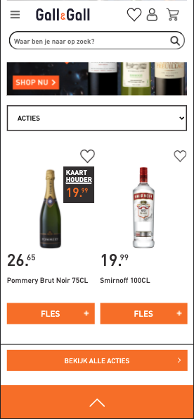
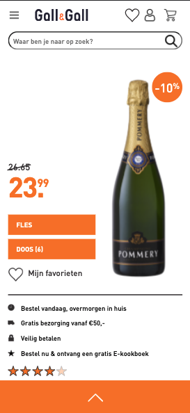

# Procesverslag
Markdown is een simpele manier om HTML te schrijven.  
Markdown cheat cheet: [Hulp bij het schrijven van Markdown](https://github.com/adam-p/markdown-here/wiki/Markdown-Cheatsheet).

Nb. De standaardstructuur en de spartaanse opmaak van de README.md zijn helemaal prima. Het gaat om de inhoud van je procesverslag. Besteedt de tijd voor pracht en praal aan je website.

Nb. Door *open* toe te voegen aan een *details* element kun je deze standaard open zetten. Fijn om dat steeds voor de relevante stuk(ken) te doen.

## Jij

uitwerken voor kick-off werkgroep

### Auteur:
Stefan Radouane

#### Je startniveau:
Mijn start niveau is de blauwe piste, ik vind coderen nog best wel lastig. Hoewel ik het wel heel leuk vind. Als ik code eenmaal doorheb dan kan ik het ook wel een beetje. Daarom ga ik ondanks dat mijn start niveau blauw is toch een poging doen op de rode piste. Ik wil namelijk beter worden in FED en daarom wil ik mijzelf uitdagen om het lastiger te maken voor mijzelf.

#### Je focus:
hier je focus (kies uit responsive óf surface plane)
 Ik ga mij focussen om de surface plane te maken. Ik wil mijzelf uitdagen om gave dingen te creeeren met HTML//CSS & Javascript, ik ben nog niet zo goed in deze programeer talen dus wil het graag beter leren en denk dat ik dit beter kan als ik mij focus op de surface laag. Daarom ga ik mij focussen op de surface laag.

## Je website

uitwerken voor kick-off werkgroep

### Je opdracht:
link naar de website die je gaat namaken óf de naam/omschrijving van je eigen ontwerp
https://www.gall.nl/?utm_source=pfh&utm_medium=affiliate&utm_campaign=startpaginahome
dit is de website van de gall en gall
#### Screenshot(s) van de eerste pagina (small screen): 
Homepagina 

#### Screenshot(s) van de tweede pagina (small screen):
Detailpagina fles drank

 

## Breakdownschets (week 1)

uitwerken na afloop 2e werkgroep

### de hele pagina: 

### dynamisch deel menu: 

## Voortgang 1 (week 2)

uitwerken voor 1e voortgang

### Stand van zaken
hier dit ging goed & dit was lastig (neem ook screenshots op van delen van je website en code)
Nog typen...

### Agenda voor meeting
samen met je groepje opstellen

| student 1      | Rosella      | section zonder heading            | h3 twee worden apart stylen  | crop img asymmetrisch            |
| student 2      | Hong         | transparante animatie achtergrond | maps op website              | img grijswaarde maken css        |
| student 3      | Ilias        | mediaqueries                      | online font                  | flexbox met een kolom            |
| student 4      | Stefan       | A centreren in li                 | items aan dropdown toevoegen | Lijst onzichtbaar maken met knop |

### Verslag van meeting
hier na afloop snel de uitkomsten van de meeting vastleggen

- Tijdens de feedback sessei heeft de studentassistent mij goed geholpen. hij heeft de li gecentreerd voor mij.
- mij geleerd hoe ik items aan een dropdown kan toevoegen
- en hoe ik een lijst ontzichtbaar kan maken met een knop. dit heb ik toegevoegd op mijn "meer" navigatie sectie

## Voortgang 2 (week 3)

uitwerken voor 2e voortgang

### Stand van zaken
hier dit ging goed & dit was lastig (neem ook screenshots op van delen van je website en code)

### Agenda voor meeting
samen met je groepje opstellen

| student 1      | Rosella      | JS/CSS header kruisje/ hamburger  | CSS tweede html pagina            | Hoeveel media queries?            |
| student 2      | Hong         | Mag een 2e css pagina?            | CSS background image cover        | Hover van afbeelding naar video . |
| student 3      | Ilias        | Hamburger menu lay-out            | CSS grid grootte                  | Hoe excact namaken?               |
| student 4      | Stefan       | img met transition                | meerder elementen queryselectorall| achtergrond een wazige kleur geven|

### Verslag van meeting
hier na afloop snel de uitkomsten van de meeting vastleggen

- Tijdens de feebacksessie is ons groepje een hoop geholpen. Iedereen heeft zijn vragen beantwoord gekregen.
- Ik heb een hoop nieuwe dingen geleerd over HTML en JavaScript, en weet nu hoe ik de querySelectorAll moet gebruiken.
- Daarnaast heb ik geleerd dat ik een img niet een transitie kan geven wat ik wil. Maar een SVG kan wel.

## Toegankelijkheidstest (week 4)

uitwerken na test in 8e voortgang

### Bevindingen
Lijst met je bevindingen die in de test naar voren kwamen:
- De meeste knoppen zijn goed klikbaar ookal heb je moeite met je hand bewegen.
- Nog niet alle knoppen zijn tabbaar.
- De hartjes vallen niet heel erg op door de dunne lijn er omheen.
- Tot slot was het contrast nog niet overal voldoende. ik kan dit oplossen door een dark-mode te introduceren.

#### Knoppen tabbaar maken
Ik heb dit opgelost door aan de knoppen die nog niet tabbaar zijn de tag tabindex="0" meegegeven. Dit zorgt dat wanneer je op tab drukt dit ook een optie is in de flow.

#### Hartjes laten opvallen
Ik ben er achter gekomen terwijl ik een bril op had dat de hartjes nog niet goed zichtbaar zijn. Ik heb hier een keyframe toegevoegd met de animatie pulse. De hartjes lijken nu een hartslag te hebben. Dit zorgt ervoor dat de hartjes meer opvallen en de aandacht opeisen.

#### Contrast
Terwijl ik een bril ophad kwam ik erachter dat het contrast van sommige knoppen en tekst nog niet optimaal is. Om dit te verbeteren heb ik een dark-modus geintroduceert. Met een knop kan je beeldelementen in contrast zetten. De kleuren veranderen een klein beetje, maar worden beter zichtbaar. 

## Voortgang 3 (week 4)

uitwerken voor 3e voortgang

### Stand van zaken
hier dit ging goed & dit was lastig (neem ook screenshots op van delen van je website en code)

### Agenda voor meeting
samen met je groepje opstellen

| student 1      | Rosella      | JS animation                           | Darkmode colors in root            | Footer flexen?          |
| student 2      | Hong         | Met media queries html aanpassen       | 9 images toevoegen met 1 button    | hamburger menu animatie |
| student 3      | Ilias        | Flexbox en css grid                    | logo in het midden                 | image width             |
| student 4      | Stefan       | Accordion maken                        | Svg stroke uitlijnen naar binnen   | pagina's overeenkomen?  |

### Verslag van meeting
hier na afloop snel de uitkomsten van de meeting vastleggen

- Tijdens deze laatste feedback sessie heeft iedereen de laatste feedback gekregen om alle puntjes op de i te zetten. Iedereen heeft zijn laatste vragen beantwoord gekregen.
- Ik heb de tag "< details >" & "< summary >" geleerd en heb goede voorbeelden gekregen om deze toe te passen. 
- Daarnaast heb ik geleerd dan ik een svg stroke niet kan uitlijnen naar binnen. Maar dat ik wel dit kan makkelijk kan animeren. Ik ben gelijk geholpen met de animatie. 

## Eindgesprek (week 5)

uitwerken voor eindgesprek

### Stand van zaken
Een hoop dingen gingen goed, maar ik heb tegen veel problemen aangelopen. Het centreren van onderdelen lukte mij niet heel goed aan het begin. Dat gaat nu al een stuk beter. Ik heb geleerd om varibalen te maken via :root, svg's animeren, heb mijn javascript kennis verder uitgebreid, ik kan nu een menu maken dat uitklapt, een dark-modus integreren & een winkelwagen immiteren. Kortom ik heb een hoop nieuwe dingen geleerd. Ik liep alleen wel tegen tijdnood aan. Er wordt dit blok veel van je verwacht door het vak vormgeving. De deadlines zitten kort op elkaar waardoor de focus op beide vakken minder goed lukt. Desalniettemin ben ik trots op het eindresultaat.

### Screenshot(s)

## Bronnenlijst

continu bijhouden terwijl je werkt

Nb. Wees specifiek ('css-tricks' als bron is bijv. niet specifiek genoeg).

1. Tabindek MDN web docs https://developer.mozilla.org/en-US/docs/Web/HTML/Global_attributes/tabindex
2. Details MDN web docs https://developer.mozilla.org/en-US/docs/Web/HTML/Element/details
3. DLO 
4. Animate any SVG icons with CSS only https://www.youtube.com/watch?v=0cYdA4MBwhk&t=305s
5. Muziek op de achtergrond https://www.youtube.com/watch?v=be1VcPdGaPI

